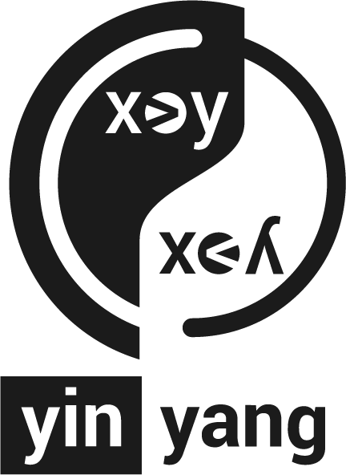

yinyang: a fuzzer for SMT solvers 
====================================

yinyang is a `fuzzing framework <https://en.wikipedia.org/wiki/Fuzzing>`_ for SMT solvers. It realizes three tools `typefuzz`, `opfuzz` and `yinyang`.  Given a set of `SMT-LIB <http://smtlib.cs.uiowa.edu/language.shtml>`_ seed formulas, each of the tools generates mutant formulas to stress-test SMT solvers. yinyang roughly operates in the following stages: 

1. *Parsing:* First, yinyang parses a single or a set of SMT-LIB formulas to be used for fuzzing. yinyang's parser supports the SMT-LIB v2.6 standard and is customizable. 

2. *Mutation:* Next, yinyang will mutate the parsed formula(s) using a mutation strategy. yinyang ships three mutation stragies. The most powerful one is generative type-aware operator mutation which mutates expressions within seed formulas and will by default generate 300 mutant formulas per parsed formula.

3. *Oracle Check:* Finally, yinyang will query the SMT solvers under test with the mutant formulas and compare the result against a test oracle. By default, such a test oracle would be a second SMT solver but it can also be fixed to be sat or unsat.

yinyang is intended for use by (1) SMT solver developers testing existing solvers, (2) researchers inventing new decision procedures to asses the robustness of their implementations, and (3) practitioners developing applications based on SMT solvers.

.. toctree::
   :maxdepth: 2
 
   installation     
   setup
   basic_usage
   customization    
   fusion 
   building_on
